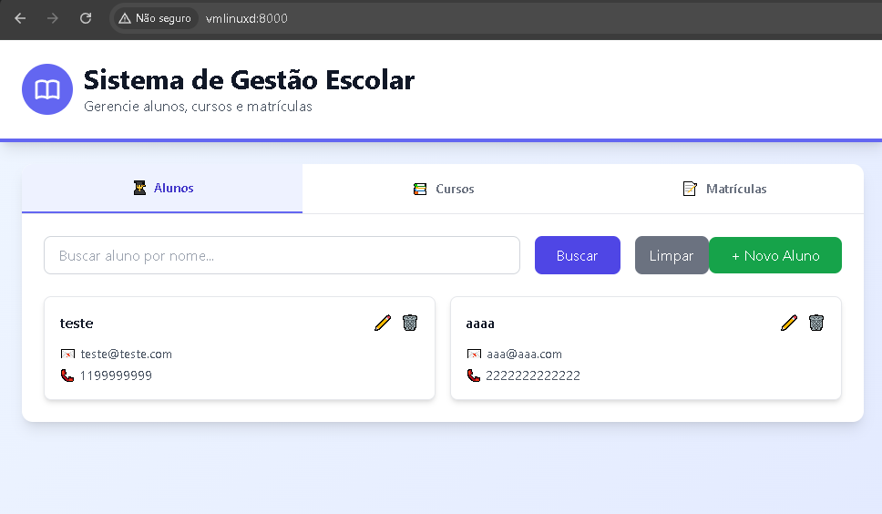

<!-- 
  Tags: DevOps,Monolíto
  Label: 📚 Sistema de Gestão Escolar
  Description: A aplicação possui uma API backend construída com **FastAPI** e um frontend interativo desenvolvido com **React** e **Tailwind CSS**. O banco de dados é gerenciado por **SQLAlchemy** com SQLite, e a aplicação é containerizada utilizando **Docker**. Este projeto foi desenvolvido como parte da **Imersão DevOps da Alura**.
  path_hook: hookfigma.hook18,hookfigma.hook14
-->

# 📚 Sistema de Gestão Escolar

<div align="center">
  
  
  
  
  
  
  
  
  **Uma solução completa para gerenciamento educacional desenvolvida durante a Imersão DevOps da Alura**
</div>

## 🎯 Sobre o Projeto

O **Sistema de Gestão Escolar** é uma aplicação web moderna e completa para gerenciar alunos, cursos e matrículas em instituições de ensino. Construído com arquitetura monolítica robusta, combina um backend poderoso em FastAPI com um frontend responsivo em React, tudo containerizado com Docker para facilitar o deployment.

### ✨ Principais Características

- **Interface Intuitiva**: Frontend responsivo com React e Tailwind CSS
- **API Robusta**: Backend FastAPI com documentação automática
- **Containerização**: Pronto para produção com Docker
- **CI/CD**: Pipeline automatizado com GitHub Actions
- **Validações**: Tratamento robusto de erros e validação de dados
- **Pesquisa Avançada**: Busca por nome parcial/completo e filtros

## 🚀 Funcionalidades

### 👥 Gerenciamento de Alunos
- ✅ Cadastro completo de alunos com validação de email
- ✅ Edição e exclusão de registros
- ✅ Busca por nome (parcial/completo) ou email
- ✅ Listagem com paginação

### 📖 Gerenciamento de Cursos
- ✅ Criação e atualização de cursos
- ✅ Visualização detalhada de informações
- ✅ Proteção contra exclusão acidental
- ✅ Códigos únicos para identificação

### 🎓 Gerenciamento de Matrículas
- ✅ Associação de alunos a cursos
- ✅ Consulta por nome do aluno ou código do curso
- ✅ Controle de duplicatas
- ✅ Histórico de matrículas

### 🔧 Recursos Técnicos
- ✅ Validação robusta de dados
- ✅ Tratamento de erros com mensagens detalhadas
- ✅ Interface com navegação por abas
- ✅ Modais para formulários
- ✅ Sistema de notificações
- ✅ Documentação interativa da API

## 🛠️ Stack Tecnológica

### Backend
- **Python 3.9+** - Linguagem principal
- **FastAPI** - Framework web moderno e rápido
- **SQLAlchemy** - ORM para banco de dados
- **Pydantic** - Validação e serialização de dados
- **SQLite** - Banco de dados leve para desenvolvimento

### Frontend
- **React 18** - Biblioteca para interface de usuário
- **Tailwind CSS** - Framework CSS utilitário
- **Babel** - Transpilação JSX no navegador

### DevOps & Infraestrutura
- **Docker** - Containerização
- **Docker Compose** - Orquestração de containers
- **GitHub Actions** - Pipeline CI/CD
- **Google Cloud Run** - Deployment em nuvem

## 📁 Estrutura do Projeto

```
gestaoedu/
├── 📁 routers/
│   ├── 📄 alunos.py             # Endpoints para alunos
│   ├── 📄 cursos.py             # Endpoints para cursos
│   └── 📄 matriculas.py         # Endpoints para matrículas
├── 📁 templates/
│   └── 📄 index.html            # Frontend React SPA
├── 📁 .github/
│   └── 📁 workflows/
│       └── 📄 docker-image.yml  # Pipeline CI/CD
├── 📄 app.py                    # Aplicação FastAPI principal
├── 📄 database.py               # Configuração do banco
├── 📄 models.py                 # Modelos SQLAlchemy
├── 📄 schemas.py                # Esquemas Pydantic
├── 📄 requirements.txt          # Dependências Python
├── 📄 docker-compose.yml        # Configuração Docker
├── 📄 Dockerfile                # Imagem Docker (python:3.9-slim)
└── 📄 README.md                 # Este arquivo
```

## 🔧 Instalação e Configuração

### Pré-requisitos
- **Python 3.9+**
- **Docker** e **Docker Compose**
- **Git**
- **Google Cloud SDK** (para deploy em nuvem)

### 🐳 Instalação com Docker (Recomendado)

1. **Clone o repositório**:
   ```bash
   git clone https://github.com/fabiuniz/gestaoedu.git
   cd gestaoedu
   ```

2. **Execute com Docker Compose**:
   ```bash
   docker-compose up --build
   ```

3. **Acesse a aplicação**:
   - Frontend: http://localhost:8000
   - Documentação da API: http://localhost:8000/docs

### 🐍 Instalação Local (Desenvolvimento)

1. **Instale as dependências**:
   ```bash
   pip install -r requirements.txt
   ```

2. **Execute a aplicação**:
   ```bash
   uvicorn app:app --host 0.0.0.0 --port 8000 --reload
   ```

## ☁️ Deploy na Nuvem

Detalhes sobre a configuração, veja o [Guia de Configuração](README_C.md).

### Google Cloud Run
Baixar e instalar : https://cloud.google.com/sdk/docs/install-sdk
1. **Configure o Google Cloud SDK**:
   ```bash
   # Windows PowerShell
   Set-ExecutionPolicy RemoteSigned
   gcloud auth login
   gcloud config set project [ID_DO_PROJETO_DO_GOOGLE_CLOUD] (ID do seu projeto em: https://console.cloud.google.com/)
   ```

2. **Faça o deploy**:
   ```bash
   gcloud run deploy --port=8000
   ```
3. **Atualizar Seu Workflow do GitHub Actions**:
   ```bash
   # Windows PowerShell  
   name: Docker Image CI
   on:
     push:
       branches: [ "main" ]
     pull_request:
       branches: [ "main" ]
   jobs:
     build:
       runs-on: ubuntu-latest
       steps:
       - uses: actions/checkout@v4
       - name: Build the Docker image
         run: docker build . --file Dockerfile --tag my-image-name:$(date +%s)

   ```
4. **Configure o serviço**:
   - Service name: `api`
   - Region: `32` (South America East 1)

## 📚 Como Usar

### Interface Web
1. Acesse http://localhost:8000
2. Use as abas para navegar entre as seções:
   - **Alunos**: Cadastro e gestão de estudantes
   - **Cursos**: Criação e edição de cursos
   - **Matrículas**: Associação de alunos a cursos

### API REST
- **Documentação**: http://localhost:8000/docs
- **Endpoints principais**:

#### Alunos
- `GET /alunos` - Listar todos os alunos
- `POST /alunos` - Criar novo aluno
- `PUT /alunos/{aluno_id}` - Atualizar aluno
- `DELETE /alunos/{aluno_id}` - Excluir aluno
- `GET /alunos/nome/{nome_aluno}` - Buscar por nome
- `GET /alunos/email/{email_aluno}` - Buscar por email

#### Cursos
- `GET /cursos` - Listar todos os cursos
- `POST /cursos` - Criar novo curso
- `PUT /cursos/{codigo_curso}` - Atualizar curso
- `GET /cursos/{codigo_curso}` - Buscar curso específico

#### Matrículas
- `POST /matriculas` - Criar nova matrícula
- `GET /matriculas/aluno/{nome_aluno}` - Matrículas por aluno
- `GET /matriculas/curso/{codigo_curso}` - Matrículas por curso

## 🔍 Solução de Problemas

### Erros Comuns

**Erro 422 (Unprocessable Entity)**
- Verifique se os dados enviados são válidos
- Confirme que campos obrigatórios estão preenchidos
- Valide o formato do email

**Erro de CORS**
- Adicione a URL do frontend à lista `origins` em `app.py`
- Exemplo: `http://localhost:3000` para desenvolvimento

**Erro de Conexão com API**
- Verifique se o backend está rodando
- Confirme se `API_BASE_URL` está correto
- Teste os endpoints na documentação `/docs`

**Problemas com Docker**
- Verifique se as portas estão disponíveis
- Execute `docker-compose down` e `docker-compose up --build`
- Limpe containers antigos com `docker system prune`

### Logs e Debug
```bash
# Ver logs do container
docker-compose logs -f

# Executar em modo debug
uvicorn app:app --host 0.0.0.0 --port 8000 --reload --log-level debug
```

## 🤝 Contribuindo

1. Faça um fork do projeto
2. Crie uma branch para sua feature (`git checkout -b feature/AmazingFeature`)
3. Commit suas mudanças (`git commit -m 'Add some AmazingFeature'`)
4. Push para a branch (`git push origin feature/AmazingFeature`)
5. Abra um Pull Request

## 📋 Roadmap

- [ ] Implementar autenticação JWT
- [ ] Adicionar testes automatizados
- [ ] Integrar com PostgreSQL
- [ ] Implementar notificações em tempo real
- [ ] Adicionar dashboard com métricas
- [ ] Criar app mobile com React Native

## 📄 Licença

Este projeto está licenciado sob a [MIT License](LICENSE) - veja o arquivo LICENSE para detalhes.

## 👨‍💻 Autor

**Fabiano Rocha** - [Fabiuniz](https://github.com/SeuUsuarioGitHub)

Desenvolvido durante a **Imersão DevOps da Alura** 🚀

---

<div align="center">
  ⭐ Se este projeto te ajudou, considere dar uma estrela no repositório!
</div>